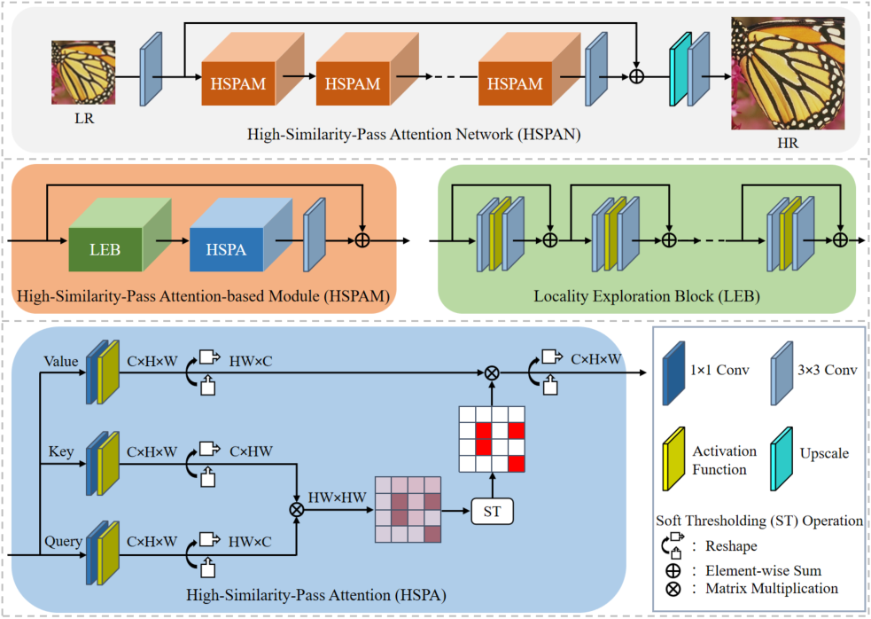

# High-Similarity-Pass Attention for Single Image Super-Resolution
This project is for HSPAN introduced in the following paper "High-Similarity-Pass Attention for Single Image Super-Resolution", submitted to IEEE TIP.

The code is test on Ubuntu 16.04 environment (Python3.6, PyTorch >= 1.1.0) with Nvidia 3090 GPUs. 
## Contents
1. [Introduction](#introduction)
2. [Train](#train)
3. [Test](#test)
4. [Acknowledgements](#acknowledgements)

## Introduction

Recent developments in the field of non-local attention (NLA) have led to a renewed interest in self-similarity-based single image super-resolution (SISR). Researchers usually use the NLA to explore non-local self-similarity (NSS) in SISR and achieve satisfactory reconstruction results. However, a surprising phenomenon that the reconstruction performance of the standard NLA is similar to that of the NLA with randomly selected regions stimulated our interest to revisit NLA. In this paper, we first analyzed the attention map of the standard NLA from different perspectives and discovered that the resulting probability distribution always has full support for every local feature, which implies a statistical waste of assigning values to irrelevant non-local features, especially for SISR which needs to model long-range dependence with a large number of redundant non-local features. Based on these findings, we introduced a concise yet effective soft thresholding operation to obtain high-similarity-pass attention (HSPA), which is beneficial for generating a more compact and interpretable distribution. Furthermore, we derived some key properties of the soft thresholding operation that enable training our HSPA in an end-to-end manner. The HSPA can be integrated into existing deep SISR models as an efficient general building block. In addition, to demonstrate the effectiveness of the HSPA, we constructed a deep high-similarity-pass attention network (HSPAN) by integrating a few HSPAs in a simple backbone. Extensive experimental results demonstrate that HSPAN outperforms state-of-the-art approaches on both quantitative and qualitative evaluations.

High-Similarity-Pass Attention for Single Image Super-Resolution (HSPAN).

## Train
### Prepare training data 

1. Download the training data (800 training + 100 validtion images) from [DIV2K dataset](https://data.vision.ee.ethz.ch/cvl/DIV2K/) or [SNU_CVLab](https://cv.snu.ac.kr/research/EDSR/DIV2K.tar).

2. Unzip the training data into the folder '../SrTrainingData'.

3. Specify '--dir_data' based on the HR and LR images path. 

For more informaiton, please refer to [EDSR(PyTorch)](https://github.com/thstkdgus35/EDSR-PyTorch).

### Begin to train

1. Cd to 'src', run the following script to train models.

    **Example command is in the file 'demo.sh'.**

    ```bash
    # Example X2 SR
    python main.py --dir_data ../../SrTrainingData --data_range 1-800/1-5 --n_GPUs 1 --rgb_range 1 --save_models --lr 1e-4 --decay 200-400-600-800 --epochs 1000 --chop --save_results --data_test Set5 --n_resgroups 10 --n_resblocks 4 --n_feats 192 --reduction 2 --topk 128 --res_scale 0.1 --batch_size 16 --model HSPAN --scale 2 --patch_size 96 --save HSPAN_x2 --data_train DIV2K

    ```

## Test
### Quick start
1. Download the pre-trained HSPAN with scale factor 4 from [BaiduYun](https://pan.baidu.com/s/1Rh_krTWZwc2tm8G1yFiIfQ?pwd=e00z) or [GoogleDrive](https://drive.google.com/file/d/11sTJWNWlt_OhL4NrwBhBGV0yC0ShtZ4D/view?usp=share_link) and place it in '/experiment/HSPAN_x4/model'.
2. Place the original test sets (e.g., Set5, other test sets are available from [GoogleDrive](https://drive.google.com/drive/folders/1xyiuTr6ga6ni-yfTP7kyPHRmfBakWovo) ) in '../SrBenchmark'.
3. Cd to 'src', run the following scripts.

    **Example command is in the file 'demo.sh'.**

    ```bash
    # Test on Set5, Set14, B100, Urban100, Manga109 datasets.
    # Example X4 SR
    python main.py --dir_data ../../ --data_test Set5+Set14+B100+Urban100+Manga109 --n_GPUs 1 --rgb_range 1 --save_models --save_results --n_resgroups 10 --n_resblocks 4 --n_feats 192  --reduction 2 --topk 128  --res_scale 0.1 --model HSPAN --save HSPAN_x4_results --chop --data_range 1-800/1-5 --scale 4 --test_only --pre_train ../experiment/HSPAN_x4/model/HSPAN_x4.pt 
    ```
   
## Acknowledgements
This work was supported in part by the National Nature Science Foundation of China under Grant 62073082, Grant 62173091; in part by the Taishan Scholar Program of Shandong Province;